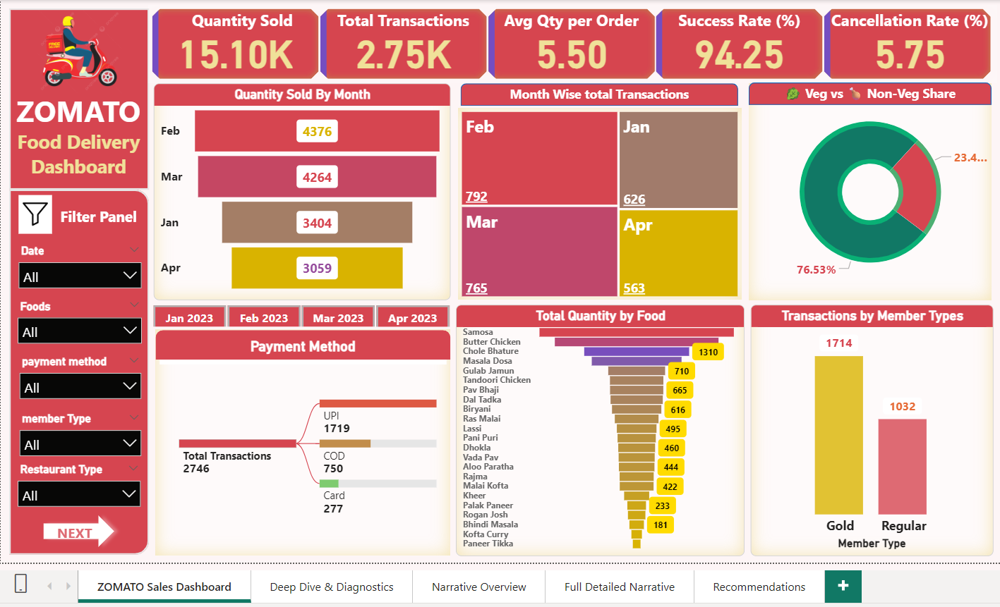
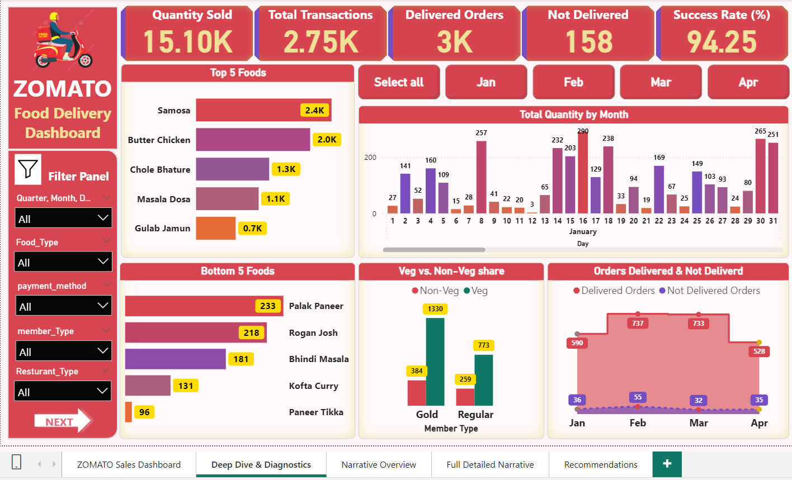
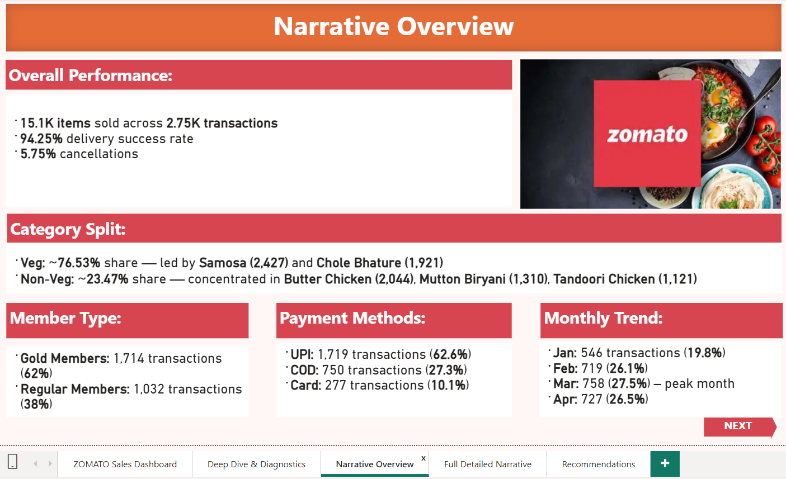
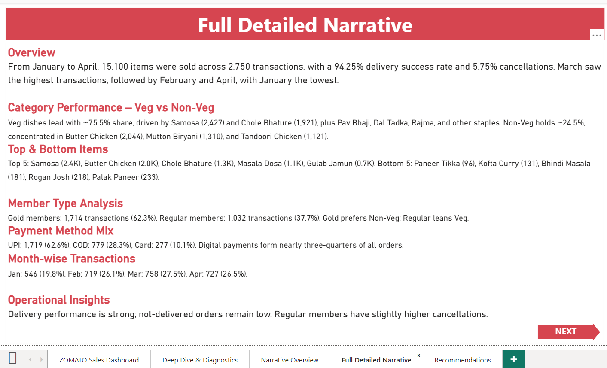
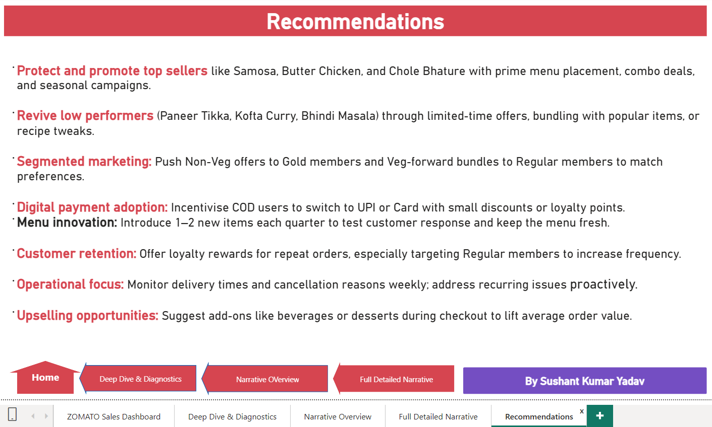

# 🍽️ Zomato Sales Analytics Dashboard

An end‑to‑end analytics project using ** Excel, and Power BI** to analyze Zomato sales (Jan–Apr 2023).  
This project demonstrates my ability to handle **data preparation, visualization, and business storytelling**.

---

## 📊 Executive Summary

- **Transactions:** ≈ 2.75K | **Total Orders:** ≈ 3K  
- **Quantity Sold:** ≈ 151K units | **Items Sold (line items):** ≈ 15.1K  
- **Delivery Success Rate:** 94.25% | **Cancellations:** 5.75%  
- **Customer Mix:** Gold 62% | Regular 38%  
- **Category Mix:** Veg 76.5% | Non‑Veg 23.5%  
- **Top Sellers:** Samosa, Chole Bhature, Butter Chicken  
- **Payments:** UPI 62.6% | COD 27.3% | Card 10.1%  
- **Monthly Trend:** Peak in March (765 transactions)  
- **Service KPIs:** Avg Rating 4.25 | Avg Delivery Time 5.75 minutes  

---

## 🚀 Business Impact

- **Loyalty Program:** Gold members drive majority of sales → expand benefits and personalization.  
- **Digital Payments:** UPI dominates → optimize wallet/UPI checkout to reduce COD reliance.  
- **Menu Optimization:** Focus on top sellers; bundle and upsell around hero items.  
- **Operational Efficiency:** Address 5.75% cancellations via staffing, prep, and routing improvements.  
- **Seasonality:** Replicate March’s campaigns; prepare for peak demand periods.  

---

## 🛠️ Tech Stack
 
- **Excel** 
- **Power BI** 

---

## 📂 Repository Structure

- `Zomato Sales.xlsx` → Raw dataset   
- `Zomato Sales Analytics.pbix` / `ZOMATO SALES DASHBOARD.pbix` → Interactive Power BI dashboards  
- `Zomato-Sales-Analytics.pdf` → Final dashboard report (static)  
- `Screenshots/` → Dashboard preview images  

---

## 📸 Dashboard Preview

  
  
 
 
 

---

## 📄 Access the Dashboard

- 👉 [View Full Report](Zomato%20Sales%20Analytics.pdf)
 
- 📂 Download the `.pbix` file to explore interactively in Power BI  

---

## 👤 Author

**Sushant Kumar Yadav**  
- [GitHub](https://github.com/Skysushant7366/)  
- [LinkedIn](https://linkedin.com/in/sushantkumaryadav310899/)  

---
